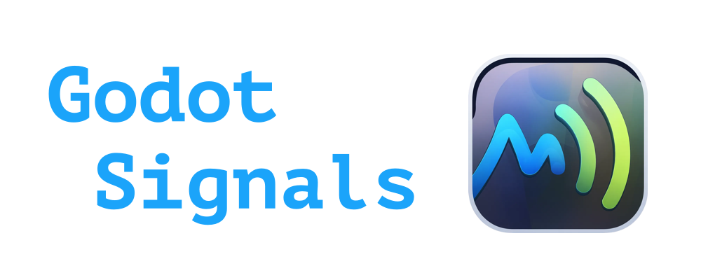

<p align="center">
    
</p>

[](https://github.com/Earewien/godot-signals/actions/workflows/unit_tests.yml)


A powerful signal system for Godot Engine that provides efficient signal handling with support for filtering, mapping, centralized event management, and high-performance signal processing.

## ✨ Features

- 🔄 **Signal Processing**: Create signal processing chains with filter and map operations
- 📡 **Signal Broker**: Connect signals across your game without direct object references
- ⚡ **Smart Connection Types**: Automatically optimizes for high or low frequency signals
- 🔍 **Pattern Matching**: Subscribe to signals using wildcard patterns
- 🏷️ **Alias System**: Identify objects by name, groups, or custom aliases
- 🚀 **Optimized Performance**: Reduced overhead and minimal allocations for efficient processing

## 🚀 Quick Start

### 🔄 Signal Processing

Create powerful signal processing chains with just a few lines of code:

```gdscript
# Filter, transform, and react to signals
GSignals.from(damage_signal)
    .filter(func(amount: int) -> bool: return amount >= 10)
    .map(func(amount: int) -> int: return amount * critical_multiplier)
    .bind(func(final_damage: int): apply_damage(final_damage))
```

### 📡 Signal Broker

Connect components without direct references:

```gdscript
# Broadcasting side: Register player node's signals with the broker
GBroker.broadcast_signals_of(player_node, "player")

# Listening side: Subscribe to player damage events anywhere in your code
GBroker.subscribe("player:damage_taken", func(amount): update_health_ui(amount))
```

## 📥 Installation

1. Download or clone this repository
2. Copy the `addons/godot-signals` folder into your project's `addons` directory
3. Enable the plugin in Project Settings > Plugins

## 📖 Tutorial

### 🔄 Signal Processing

#### 🔌 Basic Signal Connection

```gdscript
# Connect to a signal with a simple callback
GSignals.from(player.health_changed)
    .bind(func(new_health): update_health_bar(new_health))
```

#### 🔍 Filtering Signals

```gdscript
# Only process signals where the value meets certain criteria
GSignals.from(enemy.attack)
    .filter(func(damage: int) -> bool: return damage > 5)
    .bind(func(damage): play_heavy_hit_sound())
```

#### 🔄 Transforming Signals

```gdscript
# Transform signal data before processing
GSignals.from(position_changed)
    .map(func(pos: Vector2) -> float: return pos.distance_to(Vector2.ZERO))
    .bind(func(distance: float): set_volume(100 - distance))
```

#### ⏱️ Delaying Signals

```gdscript
# Delay signal processing by a specific time
GSignals.from(damage_taken)
    .delay(0.5)  # Delay by 0.5 seconds
    .bind(func(amount): play_delayed_damage_effect(amount))
```

#### 🛑 Debouncing Signals

```gdscript
# Debounce rapid signal emissions
GSignals.from(mouse_moved)
    .debounce(0.1)  # Only process after 0.1s of inactivity
    .bind(func(position): update_hover_effect(position))
```

#### 🎛️ Connection Management

```gdscript
# Store and manage connections
var connection = GSignals.from(timer.timeout).bind(func(): spawn_enemy())

# Temporarily disable connection
connection.stop()

# Re-enable connection
connection.start()
```

### 📡 Signal Broker

#### 📣 Broadcasting Signals

```gdscript
# Register an object's signals with the broker
GBroker.broadcast_signals_of(
    player,                   # The object whose signals will be broadcasted
    "player",                 # Alias for identifying the object (optional)
    GBroker.GBrokerBroadcastFlags.SCRIPT_ONLY  # Which signals to broadcast
)
```

#### 🏷️ Setting Multiple Aliases

```gdscript
# Register with multiple aliases for more flexible subscription patterns
GBroker.broadcast_signals_of(
    boss_entity,
    ["boss", "enemy", "entity"]
)
```

#### 👂 Subscribing to Signals

```gdscript
# Subscribe to specific signals
GBroker.subscribe("player:health_changed", func(new_health): update_health_ui(new_health))

# Use wildcard patterns to subscribe to multiple signals
GBroker.subscribe("player:*", func(emitter, signal_name, args): print("Player signal: ", signal_name))
GBroker.subscribe("*:damage_taken", func(damage): update_global_damage_counter(damage))
```

#### 🧹 Cleanup

```gdscript
# Clear all subscriptions and signal handlers when switching scenes
func _exit_tree():
    GBroker.reset()
```

### 🔬 Advanced Broker Usage

#### 📊 Callback Arguments Handling

The broker intelligently handles callback arguments depending on how many parameters your callback function accepts:

```gdscript
# Just receive the signal arguments (most common)
GBroker.subscribe("player:health_changed", func(health_amount): update_ui(health_amount))

# Receive emitter object, signal name, and arguments
GBroker.subscribe("player:*", func(emitter, signal_name, args):
    print("Signal %s from %s with args %s" % [signal_name, emitter.name, args])
)

# Mixed patterns with different argument counts
GBroker.subscribe("enemy:hit", func(damage, hit_position):
    spawn_particle(hit_position)
    apply_damage(damage)
)

# Missing arguments are filled with null
GBroker.subscribe("*:*", func(emitter, signal_name, arg1, arg2, arg3):
    # arg2 and arg3 will be null if the signal emits less than 3 arguments
    print("%s emitted %s with up to 3 args: %s, %s, %s" % [
        emitter.name, signal_name, arg1, arg2, arg3
    ])
)
```

##### 📝 Notes on argument handling:

- If the callback has fewer parameters than the signal provides, extra signal arguments are ignored
- If the callback has more parameters than the signal provides, extra callback parameters receive null
- The first callback parameter can receive the emitter object if an extra parameter is available
- The second parameter can receive the signal name if additional parameters are available
- Subsequent parameters receive the signal arguments

## 🔧 Advanced Features

### ⚡ Custom Signal Frequency Optimization

```gdscript
# Optimize for high-frequency signals (e.g., position updates)
GSignals.from(position_changed, GSignals.GSignalsBindFlags.HIGH_FREQUENCY_HINT)
```

### 🤖 Automatic Alias Detection

When no alias is provided, the broker automatically uses:

- 👥 The node's groups (except internal groups)
- 📛 The node's name
- 🔤 Snake case version of the node's name

```gdscript
# For a node named "PlayerCharacter" in group "characters"
GBroker.broadcast_signals_of(player_node)
# This will automatically register with aliases:
# - "characters" (from group)
# - "PlayerCharacter" (from name)
# - "player_character" (snake case conversion)
```

## ⚙️ Performance Considerations

- 🔗 Chain operations carefully as each adds processing overhead
- 🏎️ Use the `HIGH_FREQUENCY_HINT` flag for signals that emit multiple times per frame
- 🧠 The pattern matching system uses caching to optimize frequent signal matches
- 🔌 Direct signal connections with GSignals are more efficient than broker subscriptions when you have direct references

## 📄 License

This project is licensed under the MIT License - see the LICENSE file for details.
